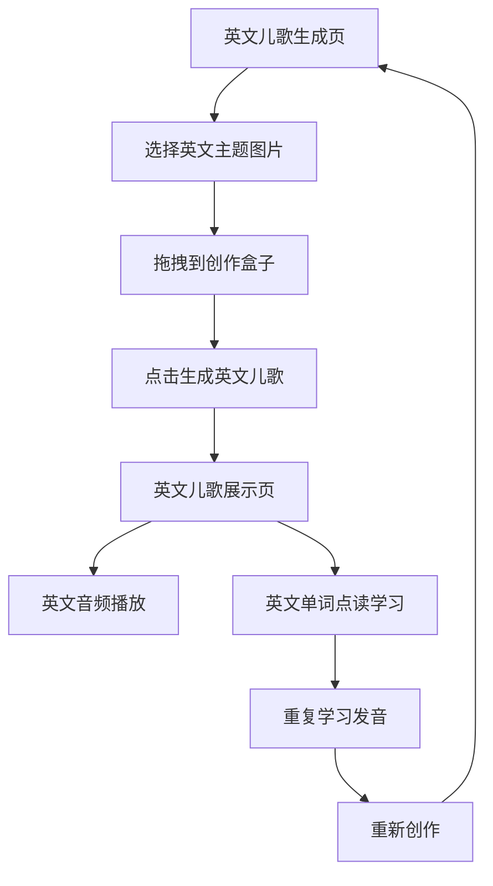

# RhymeTime AI 产品需求文档

## 1. 产品概述

RhymeTime AI 是一个专为3-8岁中国儿童设计的英文儿歌学习工具，通过拖拽式交互让儿童轻松创作个性化英文儿歌。

* 核心目标：帮助中国儿童通过有趣的英文儿歌学习英语，提供沉浸式的英语启蒙体验，培养英语语感和兴趣。

* 教育价值：结合AI技术和儿童心理学，通过音乐和韵律帮助儿童记忆英文单词，提升英语听说能力。

* 市场价值：填补儿童英语学习工具的创新空白，为中国家长提供高质量的英语启蒙数字化教育产品。

## 2. 核心功能

### 2.1 用户角色

| 角色   | 使用方法      | 核心权限                  |
| ---- | --------- | --------------------- |
| 儿童用户 | 打开即用，无需注册 | 可以拖拽创作、生成儿歌、音频朗读、单词点读 |

### 2.2 功能模块

我们的英文儿歌学习应用包含以下主要页面：

1. **英文儿歌生成页**：拖拽式创作界面，英文主题图片素材区，创作盒子，生成英文儿歌按钮。
2. **英文儿歌展示页**：英文儿歌内容展示，英文音频播放控制，英文单词点读学习功能。

### 2.3 页面详情

| 页面名称    | 模块名称    | 功能描述                             |
| ------- | ------- | -------------------------------- |
| 英文儿歌生成页 | 英文图片素材区 | 展示预置的动物和天气英文主题图片，支持拖拽操作，英文标签分类   |
| 英文儿歌生成页 | 创作盒子    | 可爱的拖拽目标区域，显示已选择的英文主题图片，支持移除操作    |
| 英文儿歌生成页 | 拖拽交互    | 支持鼠标拖拽操作，将英文主题图片从素材区拖到创作盒子       |
| 英文儿歌生成页 | 英文儿歌生成  | 大按钮设计，点击后调用AI生成英文儿歌，显示加载状态和英文提示  |
| 英文儿歌展示页 | 英文儿歌展示  | 美观的英文文本展示，突出英文韵律和节奏，适合儿童阅读的字体    |
| 英文儿歌展示页 | 英文音频播放  | 完整英文儿歌朗读，标准英文发音，播放/暂停控制，进度条显示    |
| 英文儿歌展示页 | 英文单词点读  | 点击任意英文单词进行单独发音学习，高亮显示当前单词，帮助英语学习 |
| 英文儿歌展示页 | 播放控制    | 英文音频播放、暂停、进度条、音量控制               |
| 英文儿歌展示页 | 重新创作    | 返回生成页面，开始新的英文儿歌创作                |

## 3. 核心流程

英文儿歌学习流程简洁明了：

1. 打开应用，进入英文儿歌生成页
2. 浏览预置的英文主题图片素材（动物、天气等）
3. 拖拽感兴趣的图片到创作盒子中
4. 点击"创建英文儿歌"按钮
5. AI生成个性化英文儿歌内容
6. 跳转到英文儿歌展示页，查看和聆听英文儿歌
7. 使用英文音频播放控制和英文单词点读学习功能
8. 通过重复聆听和点读学习英文发音和词汇
9. 可选择重新创作新的英文儿歌

儿童用户主要操作流程：

**儿歌创作流程：**

1. 打开应用 → 直接进入儿歌生成页
2. 浏览图片素材 → 选择感兴趣的动物或天气图片
3. 拖拽图片到创作盒子 → 可拖拽多个图片
4. 点击"创建儿歌"按钮 → 等待AI生成
5. 进入儿歌展示页 → 查看生成的儿歌
6. 播放完整朗读 → 听儿歌音频
7. 点击单词进行点读 → 学习发音
8. 返回重新创作 → 开始新的创作

## 4. 用户界面设计

### 4.1 设计风格

* **主色调**：温暖的橙色 (#FF6B35) 和清新的青色 (#4ECDC4)

* **辅助色**：柔和的黄色 (#FFE66D) 和淡紫色 (#A8E6CF)

* **按钮风格**：圆角矩形，3D效果，大尺寸适合儿童点击

* **字体**：友好的圆体字，大字号，高对比度，支持英文显示优化

* **布局**：卡片式设计，顶部导航，充足的留白，适合英文内容展示

* **图标**：可爱的卡通风格，使用 Lucide React 图标库，英文标识清晰

* **动画**：柔和的过渡效果，拖拽反馈动画，英文单词高亮动效

* **英文学习元素**：单词高亮、发音提示、学习进度指示

### 4.2 页面设计概览

| 页面名称    | 模块名称    | UI元素                           |
| ------- | ------- | ------------------------------ |
| 英文儿歌生成页 | 英文图片素材区 | 网格布局，卡片式图片展示，英文标签，拖拽手势提示，英文分类  |
| 英文儿歌生成页 | 创作盒子    | 大尺寸虚线边框区域，可爱的盒子图标，英文拖拽提示文字     |
| 英文儿歌生成页 | 英文生成按钮  | 大圆角按钮，渐变背景，英文标识，点击动画，加载状态指示    |
| 英文儿歌展示页 | 英文儿歌文本  | 大字体英文显示，适合英文阅读的行间距，英文韵律高亮，滚动查看 |
| 英文儿歌展示页 | 英文音频控制  | 播放/暂停按钮，进度条，音量控制，英文时间显示，发音质量指示 |
| 英文儿歌展示页 | 英文单词点读  | 英文单词可点击高亮，标准发音反馈，学习进度提示，发音练习指导 |

### 4.3 响应式设计

产品采用移动优先的响应式设计，特别针对儿童使用习惯优化：

* 大按钮设计，适合小手指操作

* 拖拽交互优化，支持触摸设备

* 音频控制简化，一键播放/暂停

* 字体大小自适应，确保在各种设备上都清晰可读

