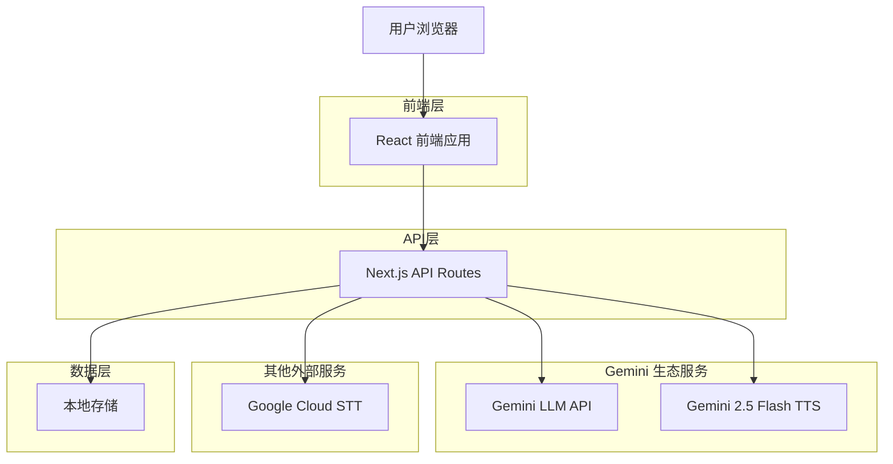
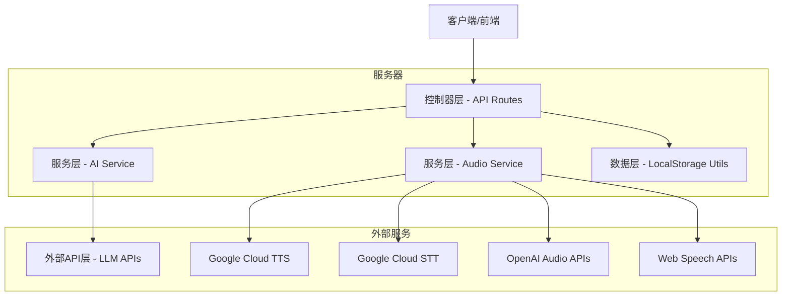
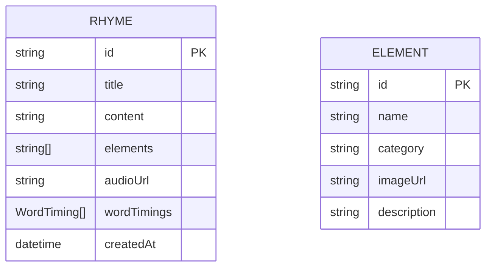

# RhymeTime AI 技术架构文档

## 1. 架构设计



## 2. 技术描述

- 前端：React@18 + Next.js@14 + TypeScript + Tailwind CSS + Framer Motion
- API：Next.js API Routes
- AI服务：OpenAI兼容API (支持OpenAI、Gemini、Claude等) - 专门配置英文儿歌生成
- TTS服务：Gemini 2.5 Flash TTS (推荐，英文语音) / Google Cloud Text-to-Speech API (英文) / OpenAI TTS API (英文) / Web Speech API
- STT服务：Google Cloud Speech-to-Text API (英文语音识别，推荐) / OpenAI Whisper API (英文) / Web Speech API
- 拖拽交互：React DnD 或 @dnd-kit/core
- 音频处理：Web Audio API
- 存储：浏览器本地存储 (localStorage)
- 图标：Lucide React
- Google Cloud SDK：@google-cloud/text-to-speech, @google-cloud/speech
- 语言配置：所有AI服务强制配置为英文模式

## 3. 路由定义

| 路由 | 用途 |
|------|------|
| / | 英文儿歌生成页，拖拽式创作界面，英文学习应用主入口 |
| /rhyme/[id] | 英文儿歌展示页，显示生成的英文儿歌内容和英文音频播放学习 |

## 4. API定义

### 4.1 核心API

英文儿歌生成相关接口

```
POST /api/generate-rhyme
```

请求参数：
| 参数名称 | 参数类型 | 是否必需 | 描述 |
|----------|----------|----------|------|
| elements | string[] | true | 拖拽选择的图片元素数组 |
| llmProvider | string | false | LLM提供商 (openai, gemini, claude等) |
| language | string | true | 固定为 "en" (英文) |

响应参数：
| 参数名称 | 参数类型 | 描述 |
|----------|----------|------|
| success | boolean | 请求是否成功 |
| data | RhymeData | 生成的英文儿歌数据 |
| error | string | 错误信息 (如果有) |

英文TTS音频生成接口

```
POST /api/generate-audio
```

请求参数：
| 参数名称 | 参数类型 | 是否必需 | 描述 |
|----------|----------|----------|------|
| text | string | true | 英文儿歌文本内容 |
| voice | string | false | 英文语音类型 (child, female, male) |
| provider | string | false | TTS服务提供商 (gemini, google-cloud, openai, web-speech) |
| speed | number | false | 语速 (0.5-2.0，默认1.0) |
| pitch | number | false | 音调 (-20.0到20.0，默认0.0) |
| language | string | true | 固定为 "en-US" (英文) |

响应参数：
| 参数名称 | 参数类型 | 描述 |
|----------|----------|------|
| success | boolean | 请求是否成功 |
| audioUrl | string | 英文音频文件URL |
| wordTimings | WordTiming[] | 英文单词时间轴数组 |
| provider | string | 实际使用的TTS提供商 |

STT时间轴分析接口

```
POST /api/analyze-speech
```

请求参数：
| 参数名称 | 参数类型 | 是否必需 | 描述 |
|----------|----------|----------|------|
| audioUrl | string | true | 音频文件URL |
| text | string | true | 对应的文本内容 |
| provider | string | false | STT提供商 (google, openai, web) |
| language | string | false | 语言代码 (zh-CN, en-US) |

响应参数：
| 参数名称 | 参数类型 | 描述 |
|----------|----------|------|
| success | boolean | 请求是否成功 |
| wordTimings | WordTiming[] | 单词时间轴数组 |
| confidence | number | 识别置信度 |

请求示例：
```json
{
  "elements": ["cat", "sun", "tree"],
  "llmProvider": "openai"
}
```

响应示例：
```json
{
  "success": true,
  "data": {
    "id": "rhyme_123",
    "title": "小猫晒太阳",
    "content": "小猫咪咪叫，太阳暖暖照，大树绿绿摇...",
    "elements": ["cat", "sun", "tree"],
    "createdAt": "2024-01-01T00:00:00Z"
  }
}
```

主题获取
```
GET /api/themes
```

响应参数:
| 参数名称 | 参数类型 | 描述 |
|----------|----------|------|
| themes | ThemeCategory[] | 主题分类数组 |

## 5. 服务器架构图



## 6. 数据模型

### 6.1 数据模型定义



### 6.2 数据定义语言

英文儿歌数据类型 (TypeScript)
```typescript
// 英文儿歌数据接口
interface RhymeData {
  id: string;
  title: string;
  content: string;
  elements: string[];
  audioUrl?: string;
  wordTimings?: WordTiming[];
  createdAt: string;
  language: 'en';
  difficultyLevel?: 'beginner' | 'intermediate' | 'advanced';
  vocabularyWords?: string[];
}

// 单词时间轴接口 (兼容多种STT服务)
interface WordTiming {
  word: string;
  startTime: number; // 秒
  endTime: number;   // 秒
  index: number;
  confidence?: number; // Google Cloud STT 置信度
  speaker?: string;    // 说话人标识 (可选)
}

// 元素接口
interface Element {
  id: string;
  name: string;
  category: 'animal' | 'weather' | 'nature';
  imageUrl: string;
  description: string;
}

// 生成请求接口
interface GenerateRhymeRequest {
  elements: string[];
  llmProvider?: 'openai' | 'gemini' | 'claude';
}

// 生成响应接口
interface GenerateRhymeResponse {
  success: boolean;
  data?: RhymeData;
  error?: string;
}

// 英文音频生成请求接口
interface GenerateAudioRequest {
  text: string;
  provider?: 'gemini' | 'google' | 'openai' | 'web';
  voice?: 'child' | 'female' | 'male';
  language: 'en-US' | 'en-GB'; // 强制英文
  speed?: number;    // 0.5-2.0 (适合儿童学习)
  pitch?: number;    // -20.0-20.0 (Google Cloud)
  childFriendly?: boolean; // 儿童友好模式
}

// 音频生成响应接口
interface GenerateAudioResponse {
  success: boolean;
  audioUrl?: string;
  wordTimings?: WordTiming[];
  provider?: string;
  error?: string;
}

// 英文STT分析请求接口
interface AnalyzeSpeechRequest {
  audioUrl: string;
  text: string; // 英文儿歌文本
  provider?: 'google' | 'openai' | 'web';
  language: 'en-US' | 'en-GB'; // 强制英文
  enableWordTimestamps: boolean; // 必须启用单词时间轴
}

// STT分析响应接口
interface AnalyzeSpeechResponse {
  success: boolean;
  wordTimings?: WordTiming[];
  confidence?: number;
  error?: string;
}

// 拖拽项目接口
interface DragItem {
  id: string;
  name: string;
  imageUrl: string;
  category: string;
}
```

预设主题数据
```typescript
// 英文儿歌预设主题分类数据
const ENGLISH_THEME_CATEGORIES: ThemeCategory[] = [
  {
    id: 'animals',
    name: 'Animals', // 英文主题名
    description: 'Cute animal friends',
    icon: '🐰',
    color: '#FF6B35',
    suggestedKeywords: ['rabbit', 'cat', 'dog', 'bird', 'elephant', 'lion']
  },
  {
    id: 'nature',
    name: 'Nature',
    description: 'Beautiful natural world',
    icon: '🌸',
    color: '#4ECDC4',
    suggestedKeywords: ['flower', 'tree', 'sunshine', 'rain', 'mountain', 'ocean']
  },
  {
    id: 'daily',
    name: 'Daily Life',
    description: 'Everyday activities',
    icon: '🏠',
    color: '#FFE66D',
    suggestedKeywords: ['eating', 'sleeping', 'playing', 'learning', 'family', 'friends']
  },
  {
    id: 'colors',
    name: 'Colors',
    description: 'Colorful world',
    icon: '🌈',
    color: '#9B59B6',
    suggestedKeywords: ['red', 'blue', 'green', 'yellow', 'purple', 'orange']
  }
];
```

本地存储工具函数
```typescript
// LocalStorage 操作工具
class RhymeStorage {
  private static FAVORITES_KEY = 'rhyme_favorites';
  private static HISTORY_KEY = 'rhyme_history';
  
  static saveFavorite(rhyme: RhymeData): void {
    const favorites = this.getFavorites();
    favorites.push(rhyme);
    localStorage.setItem(this.FAVORITES_KEY, JSON.stringify(favorites));
  }
  
  static getFavorites(): RhymeData[] {
    const data = localStorage.getItem(this.FAVORITES_KEY);
    return data ? JSON.parse(data) : [];
  }
  
  static saveToHistory(rhyme: RhymeData): void {
    const history = this.getHistory();
    history.unshift(rhyme);
    // 保留最近20条记录
    const limitedHistory = history.slice(0, 20);
    localStorage.setItem(this.HISTORY_KEY, JSON.stringify(limitedHistory));
  }
  
  static getHistory(): RhymeData[] {
    const data = localStorage.getItem(this.HISTORY_KEY);
    return data ? JSON.parse(data) : [];
  }
}
```

## 7. 英文儿歌生成与TTS/STT服务配置

### 7.0 英文儿歌生成系统提示词

```typescript
// 英文儿歌生成专用系统提示词
const ENGLISH_NURSERY_RHYME_SYSTEM_PROMPT = `
You are an expert English nursery rhyme creator for Chinese children learning English.

REQUIREMENTS:
1. Generate ONLY English nursery rhymes suitable for 3-8 year old children
2. Use simple, common English vocabulary appropriate for beginners
3. Include repetitive patterns and rhyming words for easy memorization
4. Focus on educational themes: animals, colors, numbers, daily activities
5. Keep rhymes short (4-8 lines) with clear rhythm and melody
6. Use present tense and simple sentence structures
7. Include words that help with English pronunciation practice

STYLE GUIDELINES:
- Use cheerful, positive themes
- Include action words and descriptive adjectives
- Create memorable hooks and choruses
- Ensure cultural appropriateness for Chinese children
- Add simple English learning elements (counting, colors, etc.)

EXAMPLE FORMAT:
Title: [Simple English Title]
Content: [4-8 lines of English nursery rhyme with clear rhythm]

Remember: ALL content must be in English to help children learn the language!
`;

// LLM API调用配置
const LLM_CONFIG = {
  systemPrompt: ENGLISH_NURSERY_RHYME_SYSTEM_PROMPT,
  temperature: 0.8,
  maxTokens: 200,
  language: 'en'
};
```

## 8. TTS/STT 服务集成配置

### 8.1 环境变量配置

```bash
# Gemini API 配置 (推荐，英文TTS)
GEMINI_API_KEY=your-gemini-api-key

# Google Cloud 认证 (备选，英文TTS/STT)
GOOGLE_APPLICATION_CREDENTIALS=/path/to/service-account-key.json
GOOGLE_CLOUD_PROJECT_ID=your-project-id

# TTS/STT 服务配置 (英文专用)
TTS_PROVIDER=gemini  # gemini | google-cloud | openai | web-speech
STT_PROVIDER=google-cloud  # google-cloud | openai | web-speech
LANGUAGE_MODE=en  # 强制英文模式

# Gemini TTS 配置 (英文语音)
GEMINI_TTS_MODEL=gemini-2.5-flash-preview-tts
GEMINI_TTS_LANGUAGE=en-US  # 英文语音
GEMINI_TTS_VOICE=child-friendly  # 儿童友好英文语音
GEMINI_TTS_SPEED=0.9  # 适合儿童学习的语速

# Google Cloud TTS 配置 (英文语音)
GOOGLE_TTS_LANGUAGE_CODE=en-US
GOOGLE_TTS_VOICE_NAME=en-US-Journey-D  # 儿童友好的英文语音
GOOGLE_TTS_AUDIO_ENCODING=MP3
GOOGLE_TTS_SPEAKING_RATE=0.9  # 适合儿童的语速

# Google Cloud STT 配置 (英文语音识别)
GOOGLE_STT_LANGUAGE_CODE=en-US
GOOGLE_STT_ENABLE_WORD_TIME_OFFSETS=true  # 必须启用单词时间轴
GOOGLE_STT_ENABLE_WORD_CONFIDENCE=true
GOOGLE_STT_MODEL=latest_long  # 适合儿歌的模型
```

### 8.2 Gemini 2.5 Flash TTS 实现 (推荐，英文语音)

```typescript
// lib/services/geminiTTS.ts
export class GeminiTTSService {
  private apiKey: string;
  private baseUrl = 'https://generativelanguage.googleapis.com/v1beta';
  
  constructor(apiKey: string) {
    this.apiKey = apiKey;
  }
  
  async generateAudio(request: GenerateAudioRequest): Promise<GenerateAudioResponse> {
    try {
      const response = await fetch(`${this.baseUrl}/models/gemini-2.5-flash-preview-tts:generateContent`, {
        method: 'POST',
        headers: {
          'Content-Type': 'application/json',
          'x-goog-api-key': this.apiKey
        },
        body: JSON.stringify({
          contents: [{
            parts: [{
              text: `Please convert the following English nursery rhyme text to child-friendly speech: ${request.text}`
            }]
          }],
          generationConfig: {
            voice: this.mapVoiceType(request.voice),
            speed: request.speed || 0.9, // 适合儿童学习的语速
            pitch: request.pitch || 0.0,
            language: request.language || 'en-US', // 强制英文
            audioFormat: 'mp3',
            childFriendly: true // 儿童友好模式
          }
        })
      });
      
      if (!response.ok) {
        throw new Error(`Gemini TTS API Error: ${response.statusText}`);
      }
      
      const result = await response.json();
      const audioData = result.candidates[0].content.parts[0].audioData;
      
      // 保存音频文件
      const audioUrl = await this.saveAudioFile(audioData);
      
      return {
        success: true,
        audioUrl,
        provider: 'gemini'
      };
    } catch (error) {
      console.error('Gemini TTS Error:', error);
      return {
        success: false,
        error: `Gemini TTS 生成失败: ${error.message}`
      };
    }
  }
  
  private mapVoiceType(voice?: string): string {
    const voiceMap = {
      'child': 'child-friendly',
      'female': 'female-warm',
      'male': 'male-gentle'
    };
    return voiceMap[voice] || 'child-friendly';
  }
  
  private async saveAudioFile(audioData: string): Promise<string> {
    // 将 base64 音频数据保存为文件
    const buffer = Buffer.from(audioData, 'base64');
    const filename = `gemini_audio_${Date.now()}.mp3`;
    const filepath = `public/audio/${filename}`;
    
    await fs.writeFile(filepath, buffer);
    return `/audio/${filename}`;
  }
}
```

### 7.3 Google Cloud TTS 实现 (备选)

```typescript
// lib/services/googleTTS.ts
import { TextToSpeechClient } from '@google-cloud/text-to-speech';

export class GoogleTTSService {
  private client: TextToSpeechClient;

  constructor() {
    this.client = new TextToSpeechClient({
      projectId: process.env.GOOGLE_CLOUD_PROJECT_ID,
      keyFilename: process.env.GOOGLE_APPLICATION_CREDENTIALS,
    });
  }

  async generateAudio(request: GenerateAudioRequest): Promise<GenerateAudioResponse> {
    try {
      const ttsRequest = {
        input: { text: request.text },
        voice: {
          languageCode: request.language || 'zh-CN',
          name: this.getVoiceName(request.voice, request.language),
          ssmlGender: this.getSSMLGender(request.voice),
        },
        audioConfig: {
          audioEncoding: 'MP3' as const,
          speakingRate: request.speed || 1.0,
          pitch: request.pitch || 0.0,
          volumeGainDb: 0.0,
        },
      };

      const [response] = await this.client.synthesizeSpeech(ttsRequest);
      
      // 保存音频文件并返回URL
      const audioUrl = await this.saveAudioFile(response.audioContent);
      
      return {
        success: true,
        audioUrl,
        provider: 'google',
      };
    } catch (error) {
      return {
        success: false,
        error: `Google TTS Error: ${error.message}`,
      };
    }
  }

  private getVoiceName(voice?: string, language = 'zh-CN'): string {
    const voiceMap = {
      'zh-CN': {
        child: 'zh-CN-XiaoxiaoNeural',
        female: 'zh-CN-XiaoyiNeural', 
        male: 'zh-CN-YunjianNeural',
      },
      'en-US': {
        child: 'en-US-AriaNeural',
        female: 'en-US-JennyNeural',
        male: 'en-US-GuyNeural',
      }
    };
    
    return voiceMap[language]?.[voice] || voiceMap[language]?.female || 'zh-CN-XiaoyiNeural';
  }

  private getSSMLGender(voice?: string): 'MALE' | 'FEMALE' | 'NEUTRAL' {
    switch (voice) {
      case 'male': return 'MALE';
      case 'female':
      case 'child': return 'FEMALE';
      default: return 'NEUTRAL';
    }
  }

  private async saveAudioFile(audioContent: any): Promise<string> {
    // 实现音频文件保存逻辑，返回可访问的URL
    // 可以保存到本地文件系统或云存储
    const filename = `audio_${Date.now()}.mp3`;
    const filepath = `public/audio/${filename}`;
    
    await fs.writeFile(filepath, audioContent, 'binary');
    return `/audio/${filename}`;
  }
}
```

### 7.4 TTS 服务工厂和智能降级

```typescript
// lib/services/ttsFactory.ts
export class TTSServiceFactory {
  private geminiService?: GeminiTTSService;
  private googleCloudService?: GoogleTTSService;
  private openaiService?: OpenAITTSService;
  
  constructor() {
    // 初始化可用的服务
    if (process.env.GEMINI_API_KEY) {
      this.geminiService = new GeminiTTSService(process.env.GEMINI_API_KEY);
    }
    if (process.env.GOOGLE_APPLICATION_CREDENTIALS) {
      this.googleCloudService = new GoogleTTSService();
    }
    if (process.env.OPENAI_API_KEY) {
      this.openaiService = new OpenAITTSService(process.env.OPENAI_API_KEY);
    }
  }
  
  async generateAudio(request: GenerateAudioRequest): Promise<GenerateAudioResponse> {
    const preferredProvider = request.provider || process.env.TTS_PROVIDER || 'gemini';
    
    // 服务优先级：Gemini > Google Cloud > OpenAI > Web Speech
    const serviceOrder = this.getServiceOrder(preferredProvider);
    
    for (const provider of serviceOrder) {
      try {
        const result = await this.tryProvider(provider, request);
        if (result.success) {
          return result;
        }
      } catch (error) {
        console.warn(`TTS Provider ${provider} failed:`, error.message);
        continue;
      }
    }
    
    // 最后降级到 Web Speech API
    return this.fallbackToWebSpeech(request);
  }
  
  private getServiceOrder(preferred: string): string[] {
    const allServices = ['gemini', 'google-cloud', 'openai', 'web-speech'];
    
    // 将首选服务放在第一位
    const order = [preferred];
    allServices.forEach(service => {
      if (service !== preferred) {
        order.push(service);
      }
    });
    
    return order;
  }
  
  private async tryProvider(provider: string, request: GenerateAudioRequest): Promise<GenerateAudioResponse> {
    switch (provider) {
      case 'gemini':
        if (!this.geminiService) throw new Error('Gemini TTS not configured');
        return await this.geminiService.generateAudio(request);
        
      case 'google-cloud':
        if (!this.googleCloudService) throw new Error('Google Cloud TTS not configured');
        return await this.googleCloudService.generateAudio(request);
        
      case 'openai':
        if (!this.openaiService) throw new Error('OpenAI TTS not configured');
        return await this.openaiService.generateAudio(request);
        
      default:
        throw new Error(`Unknown TTS provider: ${provider}`);
    }
  }
  
  private async fallbackToWebSpeech(request: GenerateAudioRequest): Promise<GenerateAudioResponse> {
    // Web Speech API 降级实现
    return {
      success: true,
      audioUrl: null, // Web Speech API 不生成文件
      provider: 'web-speech',
      useWebSpeech: true // 标记使用浏览器原生语音
    };
  }
}
```

### 7.5 Gemini 生态一体化优势

**为什么推荐 Gemini 2.5 Flash TTS？**

| 优势 | 说明 |
|------|------|
| **生态统一** | 与 Gemini LLM 同一提供商，API 密钥统一管理 |
| **成本效益** | 相比 Google Cloud TTS，定价更优惠 |
| **儿童友好** | 专门优化的儿童语音选项 |
| **中文支持** | 优秀的中文语音合成质量 |
| **简化集成** | 无需复杂的 Google Cloud 认证配置 |
| **快速响应** | 基于 Gemini 2.5 Flash 的快速生成能力 |

**服务选择策略：**
1. **首选**：Gemini 2.5 Flash TTS - 最佳性价比和集成体验
2. **备选**：Google Cloud TTS - 企业级稳定性
3. **兜底**：OpenAI TTS - 备用选择
4. **降级**：Web Speech API - 免费但功能有限

### 7.6 Google Cloud STT 实现

```typescript
// lib/services/googleSTT.ts
import { SpeechClient } from '@google-cloud/speech';

export class GoogleSTTService {
  private client: SpeechClient;

  constructor() {
    this.client = new SpeechClient({
      projectId: process.env.GOOGLE_CLOUD_PROJECT_ID,
      keyFilename: process.env.GOOGLE_APPLICATION_CREDENTIALS,
    });
  }

  async analyzeSpeech(request: AnalyzeSpeechRequest): Promise<AnalyzeSpeechResponse> {
    try {
      // 读取音频文件
      const audioBytes = await this.readAudioFile(request.audioUrl);
      
      const sttRequest = {
        audio: { content: audioBytes },
        config: {
          encoding: 'MP3' as const,
          sampleRateHertz: 16000,
          languageCode: request.language || 'zh-CN',
          enableWordTimeOffsets: true,
          enableWordConfidence: true,
          model: 'latest_long',
        },
      };

      const [response] = await this.client.recognize(sttRequest);
      
      if (!response.results || response.results.length === 0) {
        throw new Error('No speech recognition results');
      }

      const wordTimings = this.extractWordTimings(response.results);
      const confidence = this.calculateAverageConfidence(response.results);

      return {
        success: true,
        wordTimings,
        confidence,
      };
    } catch (error) {
      return {
        success: false,
        error: `Google STT Error: ${error.message}`,
      };
    }
  }

  private async readAudioFile(audioUrl: string): Promise<string> {
    // 实现音频文件读取逻辑
    const filepath = audioUrl.replace('/audio/', 'public/audio/');
    const audioBuffer = await fs.readFile(filepath);
    return audioBuffer.toString('base64');
  }

  private extractWordTimings(results: any[]): WordTiming[] {
    const wordTimings: WordTiming[] = [];
    let wordIndex = 0;

    for (const result of results) {
      if (result.alternatives && result.alternatives[0]) {
        const alternative = result.alternatives[0];
        
        if (alternative.words) {
          for (const wordInfo of alternative.words) {
            wordTimings.push({
              word: wordInfo.word,
              startTime: this.timeToSeconds(wordInfo.startTime),
              endTime: this.timeToSeconds(wordInfo.endTime),
              index: wordIndex++,
              confidence: wordInfo.confidence || 0,
            });
          }
        }
      }
    }

    return wordTimings;
  }

  private timeToSeconds(time: any): number {
    if (!time) return 0;
    return (time.seconds || 0) + (time.nanos || 0) / 1000000000;
  }

  private calculateAverageConfidence(results: any[]): number {
    let totalConfidence = 0;
    let wordCount = 0;

    for (const result of results) {
      if (result.alternatives && result.alternatives[0]) {
        const alternative = result.alternatives[0];
        if (alternative.words) {
          for (const wordInfo of alternative.words) {
            if (wordInfo.confidence) {
              totalConfidence += wordInfo.confidence;
              wordCount++;
            }
          }
        }
      }
    }

    return wordCount > 0 ? totalConfidence / wordCount : 0;
  }
}
```

### 7.4 服务提供商选择策略

```typescript
// lib/services/audioServiceFactory.ts
export class AudioServiceFactory {
  static createTTSService(provider?: string): TTSServiceInterface {
    const selectedProvider = provider || process.env.TTS_PROVIDER || 'google';
    
    switch (selectedProvider) {
      case 'google':
        return new GoogleTTSService();
      case 'openai':
        return new OpenAITTSService();
      case 'web':
        return new WebSpeechTTSService();
      default:
        // 降级策略：Google Cloud -> OpenAI -> Web Speech
        try {
          return new GoogleTTSService();
        } catch {
          try {
            return new OpenAITTSService();
          } catch {
            return new WebSpeechTTSService();
          }
        }
    }
  }

  static createSTTService(provider?: string): STTServiceInterface {
    const selectedProvider = provider || process.env.STT_PROVIDER || 'google';
    
    switch (selectedProvider) {
      case 'google':
        return new GoogleSTTService();
      case 'openai':
        return new OpenAISTTService();
      case 'web':
        return new WebSpeechSTTService();
      default:
        // 降级策略：Google Cloud -> OpenAI -> Web Speech
        try {
          return new GoogleSTTService();
        } catch {
          try {
            return new OpenAISTTService();
          } catch {
            return new WebSpeechSTTService();
          }
        }
    }
  }
}
```

### 7.5 服务对比

| 特性 | Google Cloud | OpenAI | Web Speech API |
|------|-------------|--------|----------------|
| **TTS质量** | 优秀 | 优秀 | 良好 |
| **STT准确性** | 优秀 | 优秀 | 良好 |
| **中文支持** | 优秀 | 良好 | 一般 |
| **儿童语音** | 支持 | 支持 | 有限 |
| **时间轴精度** | 高 | 中 | 低 |
| **成本** | 按使用付费 | 按使用付费 | 免费 |
| **离线支持** | 否 | 否 | 部分支持 |
| **配置复杂度** | 中 | 低 | 低 |

**推荐策略**：
- **生产环境**：Google Cloud (最佳质量和中文支持)
- **开发测试**：Web Speech API (免费，快速原型)
- **备用方案**：OpenAI (平衡质量和易用性)
```